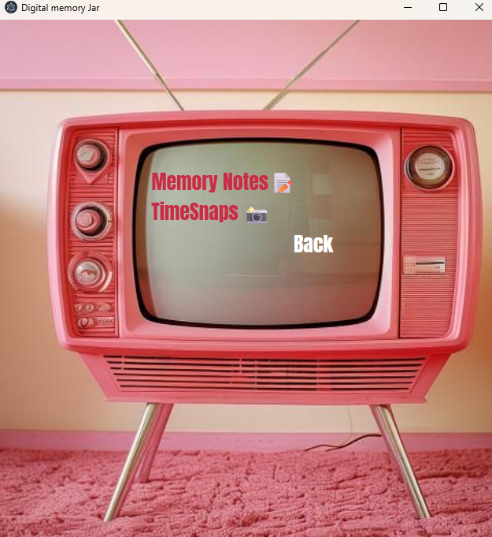
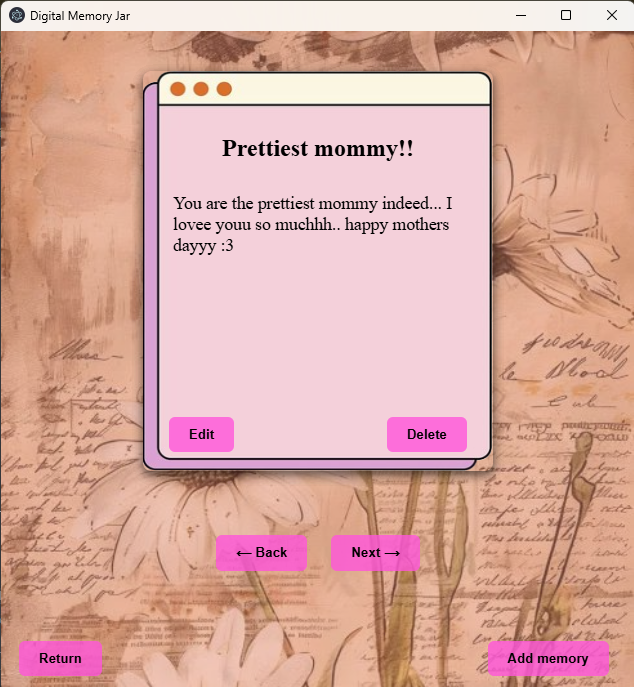
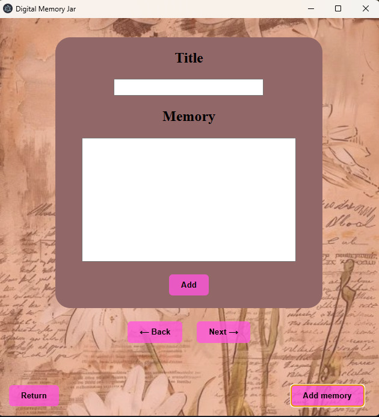
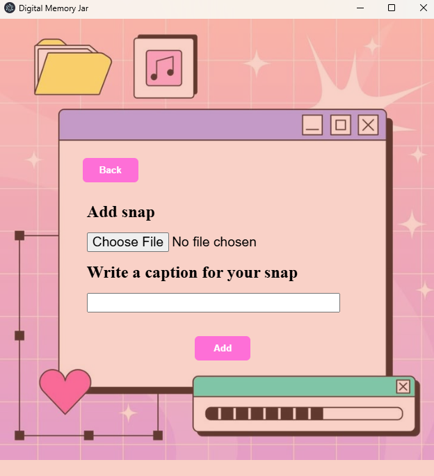
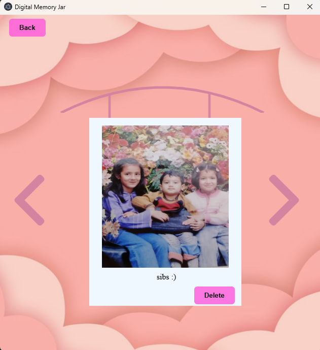

🌸 Digital Memory Jar 🫙💖
A soft-pink desktop app to keep your memories close, forever.


Because your memories deserve a cute little home!

✨ About
Digital Memory Jar is a cozy, pastel-themed desktop application where you can safely store your precious thoughts, sweet moments, and timeless snapshots — just like a real memory jar, but digital (and pink 💗). Built with HTML, CSS, JS, and Electron, it brings you a soothing interface and two lovely features:

🌟 Features
📝 Memory Notes
Add special memories or journal entries

Edit or delete your notes anytime

Flip through your notes like pages in a book 📖

📸 Time Snaps
> Save moments as “snaps” with cute captions

View your snaps and revisit the happy vibes

Delete snaps when you're ready to let go ✨

💻 Tech Stack
🎀 HTML

🎀 CSS (pink-coded!)

🎀 JavaScript

🎀 Electron.js – to turn your sweet web app into a real desktop application!

🧁 Screenshots
<div align="center">
  
  
  
  
  
  
</div>

🚀 How to Run
1. Clone the repo
```bash
git clone https://github.com/emaaanbutt/Digital-memory-Jar
```

2. Navigate into the folder
```bash
cd Digital-memory-Jar
```

3. Install dependencies
```bash
npm install
```

4. Start the app
```bash
npm start
```

💌 Aesthetic Vibes
The whole app is wrapped in soft pinks, rounded corners, and minimalist styling to give you comfort every time you open your jar of memories. 🍓🌷

🫶 Made with love by Eman
And a sprinkle of nostalgia


